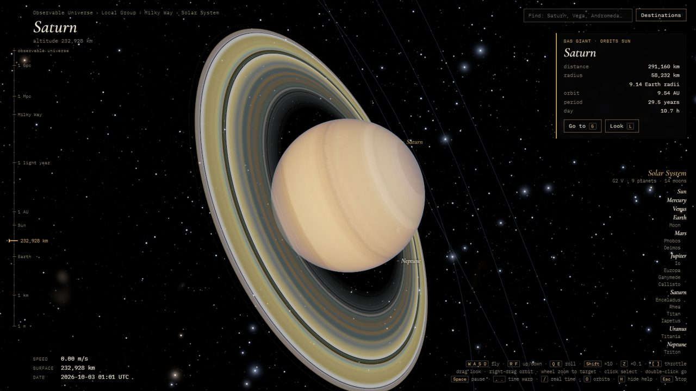
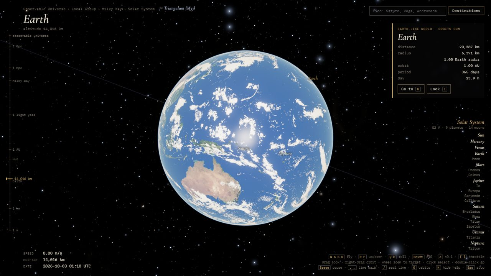
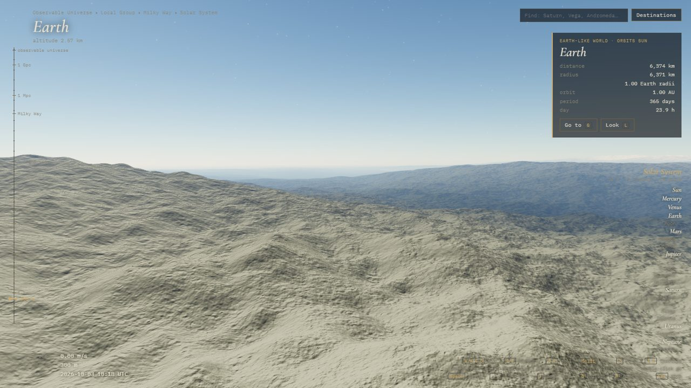
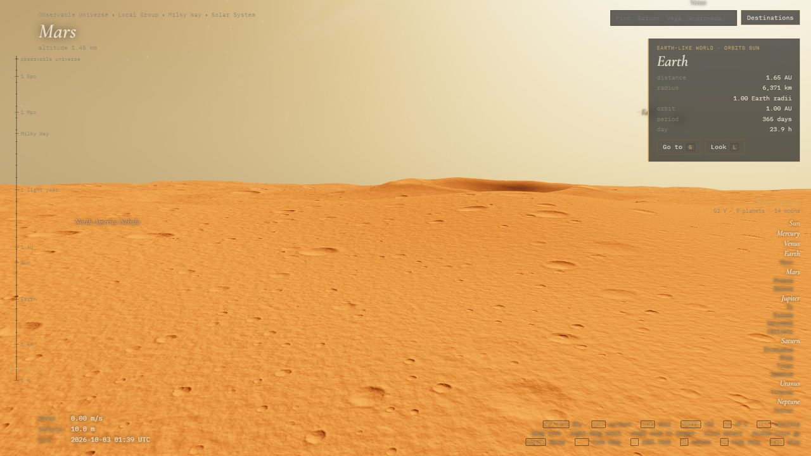
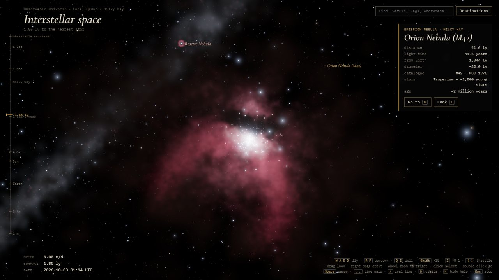
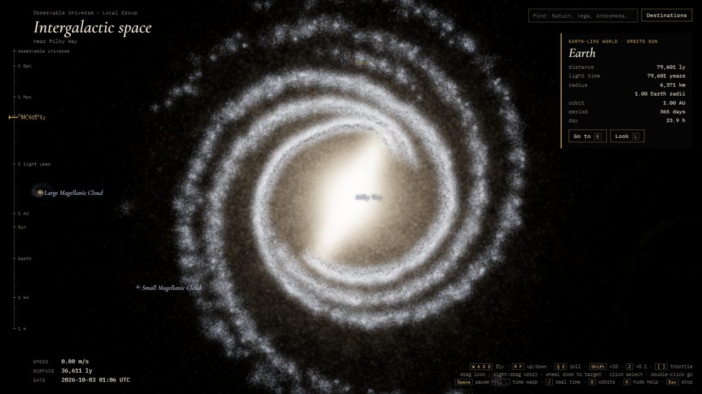
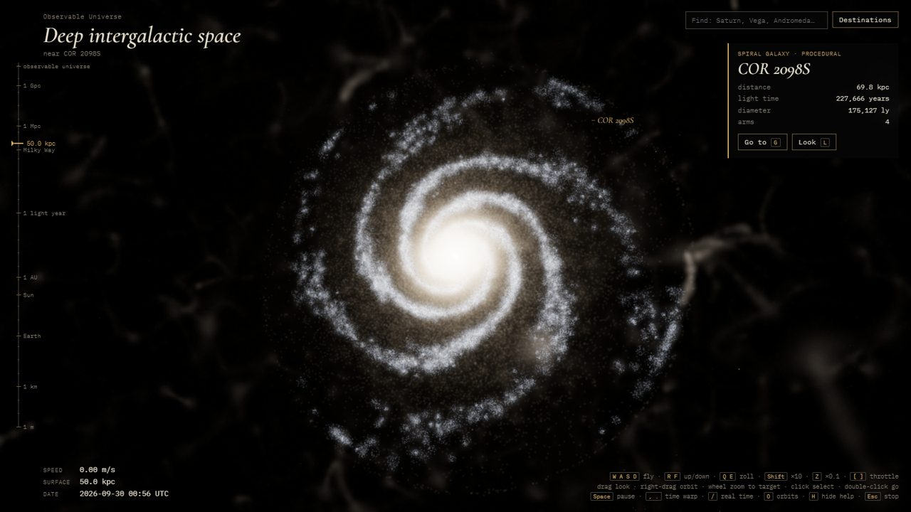
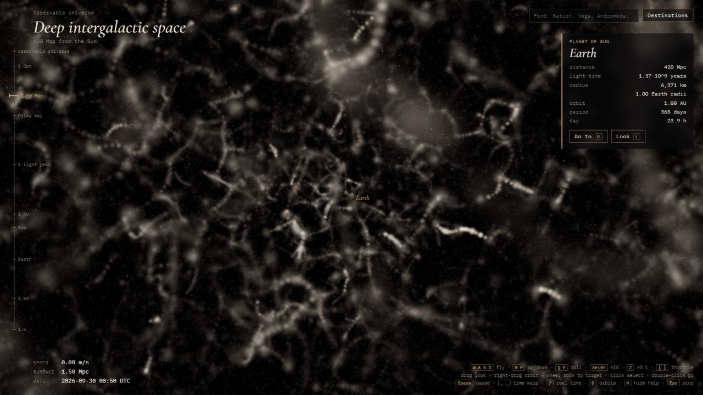
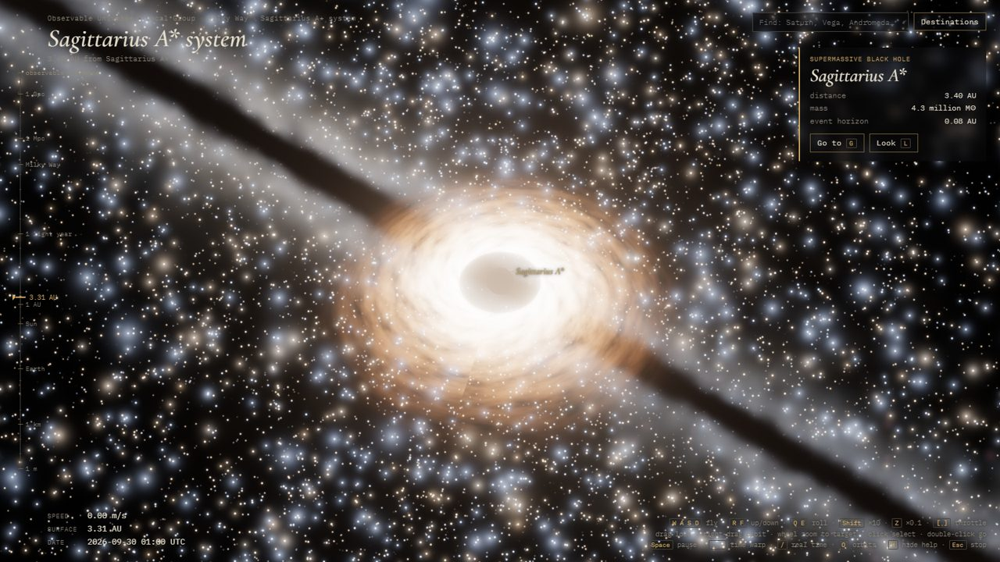

# Continuum

**The universe at 1:1 scale, in your browser.**

Fly from 2 metres above the Moon's surface out through the Solar System and across the Milky Way. Keep going past the Local Group into the cosmic web, all the way to the edge of the observable universe, without a loading screen. Every star and galaxy along the way can be visited. It is built with three.js (WebGPU + TSL) and has no build step.



## Quick start

You need a browser with WebGPU (recent Chrome or Edge) and any static file server. Nothing is installed to run the app.

```
npm start
```

Then open http://localhost:5270. `npm start` runs a tiny dependency-free server (`tools/serve.cjs`). `python -m http.server 5270` works just as well.

three.js, fonts and planet textures load from CDNs (jsdelivr, Google Fonts), so the first load needs an internet connection.

## Gallery

| | |
|---|---|
|  |  |
| Earth, lit for the real current time | Landing: terrain down to metre scale |
|  |  |
| On Mars, under a dusty sky | The Orion Nebula and the Trapezium |
|  |  |
| The Milky Way's measured arms and bar | One of billions of procedural galaxies |
|  |  |
| Filaments and voids of the cosmic web | Sagittarius A* in the galactic core |

## How the scale problem is solved

These are the same techniques SpaceEngine and Elite Dangerous use:

- **Each universe position is two numbers per axis** (`js/upos.js`): an integer cell of 2^40 m plus a float64 offset inside that cell. This keeps sub-millimetre precision anywhere in a 93-billion-light-year volume, which is precise enough to stand on a planet.
- **Rendering is camera-relative.** The camera is always at the origin. Every object is placed at `object − camera`, computed in float64 on the CPU, so only small numbers ever reach the GPU.
- **There are three render layers, each in its own unit.** They are drawn back to front, with the depth buffer cleared between them:
  - cosmos: megaparsecs
  - galaxy: light years
  - system: kilometres, with a reversed-Z float depth buffer
- **Procedural generation is hierarchical.**
  - The cosmic web is a hashed lattice of cluster nodes linked by filaments (`cosmos.js`).
  - Galaxies are density models plus particle clouds (`galaxy.js`).
  - Stars stream in per spectral class, each class on its own octree level, like Elite's boxels (`stars.js`).
  - Planetary systems, including binary and triple stars, are seeded from the star's identity (`system.js`, `binary.js`).
  - Everything is a pure function of its coordinates, so the same place is always the same.
- **Real data is used where it exists** (`catalog.js`):
  - the Solar System from J2000 Keplerian elements, with the major moons
  - 31 catalogued stars by RA/Dec/distance, including real multiple systems (Alpha Centauri, Sirius, Procyon, 61 Cygni, Capella, Castor)
  - Sagittarius A*
  - the Milky Way's measured spiral arms and bar (Reid et al. 2019)
  - 18 real nebulae and clusters (`deepsky.js`)
  - 11 nearby galaxies
- **Flight speed scales with the distance to the nearest surface**, so the same keys work at every scale. The autopilot travels in log-distance, so a trip takes a few seconds whether it is 400,000 km or a gigaparsec long.

## Realism layers

- **Earth.** It uses real NASA day, night-lights and cloud maps. It rotates by the IERS Earth Rotation Angle, so day and night match real UTC; the subsolar point checks out to about 0.1°.
- **Planet maps.** Every Solar System planet has real imagery, and Saturn's and Uranus's rings are textured. If a map fails to load, the planet falls back to its procedural look.
- **Atmospheres** (`atmosphere.js`). Single-scattering Rayleigh and Mie, raymarched per pixel. From space you see blue limbs and red terminators; from the ground you get day, sunset and night skies. Mars, Venus, Titan and every generated world type have their own settings.
- **Landing** (`terrain.js`). Rocky planets and moons get a cube-sphere quadtree, swapped in for the sphere below 3.6 radii. It is precise to metres, takes its large-scale relief from the real maps, and the camera turns with the planet near the ground.
- **Variety.** There are 15 planet types weighted by temperature: lava worlds, ocean worlds, sub-Neptunes, hot Jupiters, frozen-ocean worlds and more. There are 14 star classes, from blue supergiants to brown dwarfs.

## Going places

- **Destinations** lists named places, nearby star systems, nebulae and clusters, and three ways to wander:
  - a random system nearby
  - a random system anywhere in the current galaxy
  - a random system inside another galaxy
- **The search box** finds planets, stars, systems, nebulae and galaxies.
- **The system panel** (bottom right) lists every star, planet and moon of the system you're in.

## Controls

- **Fly:** `W A S D` move, `R F` up/down, `Q E` roll, `Shift` ×10, `Z` ×0.1, `[ ]` throttle.
- **Mouse:** drag to look, right-drag to orbit the selection, wheel to zoom toward the selection.
- **Select and travel:** click to select, double-click or `G` to go there, `L` to look at the selection.
- **Time:** `Space` pause, `, .` time warp, `/` real time.
- **View:** `O` orbit lines, `H` help, `Esc` stop the autopilot.

## Development

The code is plain ES modules in `js/`, with no bundler. Notes on each subsystem are in `notes/`.

There is a headless test harness that runs the page on the real GPU, prints console errors and saves screenshots to `shots/`:

```
npm install
```

```
node tools/check.cjs "js:uni.travel('Saturn')" "wait:20" "shot:saturn.png"
```

It uses your installed Chrome. To use a different browser, set `CHROME_PATH` (for example to Edge's `msedge.exe`).

Helper scripts for the harness live in `shots/*.js` and are loaded with a `pre:` step:
- `pre:shots/fps.js` adds `fps()`
- `pre:shots/earthview.js` adds `earthView(n)`

Console helpers in the page:
- `uni.travel(name)`
- `uni.jumpLy(x, y, z)`: coordinates are heliocentric galactic, in light years
- `uni.lookDir(x, y, z)`
- `uni.wander('near' | 'galaxy' | 'far')`

## Credits

- **Earth and Moon maps:** NASA (Blue Marble, Black Marble, LRO), via the [three.js examples](https://github.com/mrdoob/three.js/tree/dev/examples/textures/planets).
- **Planet and ring maps:** [Planet Pixel Emporium](https://planetpixelemporium.com/) by James Hastings-Trew, via [threex.planets](https://github.com/jeromeetienne/threex.planets). These are loaded from a CDN at runtime and are not redistributed in this repository.
- **Milky Way spiral arms:** Reid, M. J. et al. 2019, *Trigonometric Parallaxes of High-mass Star-forming Regions*, ApJ 885, 131.
- **Rendering:** [three.js](https://threejs.org/).
- **Fonts:** Cormorant Garamond and IBM Plex Mono (SIL Open Font License), via Google Fonts.

## Background reading

- SpaceEngine: [floating origin and multi-scale reference frames](https://en.wikipedia.org/wiki/SpaceEngine)
- [A Real-Time Procedural Universe, Part Three: Matters of Scale](https://www.gamedeveloper.com/programming/a-real-time-procedural-universe-part-three-matters-of-scale)
- [Elite Dangerous Stellar Forge: boxels and seeds](https://forums.frontier.co.uk/threads/marxs-guide-to-boxels-subsectors.618286/)
- [Outerra: logarithmic and reversed depth](https://outerra.blogspot.com/2012/11/maximizing-depth-buffer-range-and.html)
- [Quentin Santos: astronomical depth buffer](https://qsantos.fr/2021/03/22/astronomical-depth-buffer/)
